```python
import pandas as pd # data processing
import numpy as np # linear algebra
import random
#import cv2
from PIL import Image
import matplotlib as mpl
from nltk.corpus import stopwords
from scipy.misc import imread
from sklearn.feature_extraction.stop_words import ENGLISH_STOP_WORDS
from wordcloud import WordCloud, STOPWORDS
from textblob import TextBlob, Word, Blobber
from textblob.classifiers import NaiveBayesClassifier
from textblob.taggers import NLTKTagger
from os import path
from mpl_toolkits.mplot3d import Axes3D
from sklearn.preprocessing import StandardScaler
import os
```


```python
import seaborn as sns
import matplotlib.pyplot as plt
```


```python
%matplotlib inline
plt.rcParams["figure.figsize"]=(12,6)
```


```python
df=pd.read_csv('~/Desktop/proj1/data/lyrics.csv')
```


```python
#load the processed lyrics data which has the stemmed words
processed=pd.read_csv('~/Desktop/proj1/data/processed_lyrics.csv')
#processed=processed.drop('Unnamed: 0')
```


```python
df.head()
```


<div>
<style scoped>
    .dataframe tbody tr th:only-of-type {
        vertical-align: middle;
    }

    .dataframe tbody tr th {
        vertical-align: top;
    }

    .dataframe thead th {
        text-align: right;
    }
</style>
<table border="1" class="dataframe">
  <thead>
    <tr style="text-align: right;">
      <th></th>
      <th>song</th>
      <th>year</th>
      <th>artist</th>
      <th>genre</th>
      <th>lyrics</th>
    </tr>
  </thead>
  <tbody>
    <tr>
      <th>0</th>
      <td>when-you-were-with-me</td>
      <td>2009</td>
      <td>a</td>
      <td>Hip-Hop</td>
      <td>I stopped by the house we called our home\nIt ...</td>
    </tr>
    <tr>
      <th>1</th>
      <td>careless-whisper</td>
      <td>2009</td>
      <td>a</td>
      <td>Hip-Hop</td>
      <td>I feel so unsure\nAs I take your hand and lead...</td>
    </tr>
    <tr>
      <th>2</th>
      <td>2-59</td>
      <td>2007</td>
      <td>a</td>
      <td>Hip-Hop</td>
      <td>Mark:] Sunday football I got boot off the pitc...</td>
    </tr>
    <tr>
      <th>3</th>
      <td>power-of-desire</td>
      <td>2007</td>
      <td>a</td>
      <td>Hip-Hop</td>
      <td>[Chris:] Fallin' for a fantasy\nI threw away m...</td>
    </tr>
    <tr>
      <th>4</th>
      <td>you-re-not-in-love</td>
      <td>2007</td>
      <td>a</td>
      <td>Hip-Hop</td>
      <td>something in the way we touch\nyou hold my han...</td>
    </tr>
  </tbody>
</table>
</div>


```python
#let's see which years were recorded
df.year.unique()
```


    array([2009, 2007, 2013, 2005, 2012, 2002, 1997, 2000, 2008, 2016, 2006,
           2010, 2011, 2015, 2014, 1998, 1996, 1990, 2004, 2003, 2001, 1994,
           1977, 1995, 1981, 1982, 1992, 1986, 1989, 1978, 1999, 1972, 1983,
           1980, 1975, 1976, 1985, 1984, 1988, 1991, 1973, 1971, 1993, 1974,
           1987, 1970, 1979,  702,  112, 1968])


```python
#we found the dataset has two misinput value: year 702 and year 112
#let's take a closer look songs in those two years
years=[112, 702]
df.loc[df['year'].isin(years)]
#702 the song 'star' was published in 2003 & 112 the song 'anywhere-remix' was published in 1998
```


<div>
<style scoped>
    .dataframe tbody tr th:only-of-type {
        vertical-align: middle;
    }

    .dataframe tbody tr th {
        vertical-align: top;
    }

    .dataframe thead th {
        text-align: right;
    }
</style>
<table border="1" class="dataframe">
  <thead>
    <tr style="text-align: right;">
      <th></th>
      <th>song</th>
      <th>year</th>
      <th>artist</th>
      <th>genre</th>
      <th>lyrics</th>
    </tr>
  </thead>
  <tbody>
    <tr>
      <th>64363</th>
      <td>star</td>
      <td>702</td>
      <td>clipse</td>
      <td>Hip-Hop</td>
      <td>You're my star\nIt's such a wonder how you shi...</td>
    </tr>
    <tr>
      <th>91139</th>
      <td>anywhere-remix</td>
      <td>112</td>
      <td>dru-hill</td>
      <td>Hip-Hop</td>
      <td>Here we are all alone\nYou and me, privacy\nAn...</td>
    </tr>
  </tbody>
</table>
</div>


```python
#we then assigned the correct year to those two songs
df.year[df.year==702]=2003
```

    /anaconda3/lib/python3.7/site-packages/ipykernel_launcher.py:2: SettingWithCopyWarning: 
    A value is trying to be set on a copy of a slice from a DataFrame
    
    See the caveats in the documentation: http://pandas.pydata.org/pandas-docs/stable/indexing.html#indexing-view-versus-copy
      


```python
df.year[df.year==112]=1998
```

    /anaconda3/lib/python3.7/site-packages/ipykernel_launcher.py:1: SettingWithCopyWarning: 
    A value is trying to be set on a copy of a slice from a DataFrame
    
    See the caveats in the documentation: http://pandas.pydata.org/pandas-docs/stable/indexing.html#indexing-view-versus-copy
      """Entry point for launching an IPython kernel.


```python
df.artist[df.artist=='bone-thugs']='bone-thugs-n-harmony'
```

    /anaconda3/lib/python3.7/site-packages/ipykernel_launcher.py:1: SettingWithCopyWarning: 
    A value is trying to be set on a copy of a slice from a DataFrame
    
    See the caveats in the documentation: http://pandas.pydata.org/pandas-docs/stable/indexing.html#indexing-view-versus-copy
      """Entry point for launching an IPython kernel.


```python
#check if the two songs published years were changed
df.loc[[64363, 91139], :]
```


<div>
<style scoped>
    .dataframe tbody tr th:only-of-type {
        vertical-align: middle;
    }

    .dataframe tbody tr th {
        vertical-align: top;
    }

    .dataframe thead th {
        text-align: right;
    }
</style>
<table border="1" class="dataframe">
  <thead>
    <tr style="text-align: right;">
      <th></th>
      <th>song</th>
      <th>year</th>
      <th>artist</th>
      <th>genre</th>
      <th>lyrics</th>
    </tr>
  </thead>
  <tbody>
    <tr>
      <th>64363</th>
      <td>star</td>
      <td>2003</td>
      <td>clipse</td>
      <td>Hip-Hop</td>
      <td>You're my star\nIt's such a wonder how you shi...</td>
    </tr>
    <tr>
      <th>91139</th>
      <td>anywhere-remix</td>
      <td>1998</td>
      <td>dru-hill</td>
      <td>Hip-Hop</td>
      <td>Here we are all alone\nYou and me, privacy\nAn...</td>
    </tr>
  </tbody>
</table>
</div>


```python
#replace carriage returns
df = df.replace({'\n': ' '}, regex=True)
```


```python
#count the words in each song
df['word_count'] = df['lyrics'].str.split().str.len()
```


```python
def decade(c):
    if 1950 <= c and c < 1960:
        return 1950
    elif 1960 <= c and c < 1970:
        return 1960
    if 1970 <= c and c < 1980:
        return 1970
    elif 1980 <= c and c < 1990:
        return 1980
    elif 1990 <= c and c < 2000:
        return 1990
    elif 2000 <= c and c < 2010:
        return 2000
    return 2010

df['year'] = df['year'].apply(int, 1)
df['decade'] = df['year'].apply(decade)
df.head()
```


<div>
<style scoped>
    .dataframe tbody tr th:only-of-type {
        vertical-align: middle;
    }

    .dataframe tbody tr th {
        vertical-align: top;
    }

    .dataframe thead th {
        text-align: right;
    }
</style>
<table border="1" class="dataframe">
  <thead>
    <tr style="text-align: right;">
      <th></th>
      <th>song</th>
      <th>year</th>
      <th>artist</th>
      <th>genre</th>
      <th>lyrics</th>
      <th>word_count</th>
      <th>decade</th>
    </tr>
  </thead>
  <tbody>
    <tr>
      <th>0</th>
      <td>when-you-were-with-me</td>
      <td>2009</td>
      <td>a</td>
      <td>Hip-Hop</td>
      <td>I stopped by the house we called our home It w...</td>
      <td>107</td>
      <td>2000</td>
    </tr>
    <tr>
      <th>1</th>
      <td>careless-whisper</td>
      <td>2009</td>
      <td>a</td>
      <td>Hip-Hop</td>
      <td>I feel so unsure As I take your hand and lead ...</td>
      <td>300</td>
      <td>2000</td>
    </tr>
    <tr>
      <th>2</th>
      <td>2-59</td>
      <td>2007</td>
      <td>a</td>
      <td>Hip-Hop</td>
      <td>Mark:] Sunday football I got boot off the pitc...</td>
      <td>369</td>
      <td>2000</td>
    </tr>
    <tr>
      <th>3</th>
      <td>power-of-desire</td>
      <td>2007</td>
      <td>a</td>
      <td>Hip-Hop</td>
      <td>[Chris:] Fallin' for a fantasy I threw away my...</td>
      <td>147</td>
      <td>2000</td>
    </tr>
    <tr>
      <th>4</th>
      <td>you-re-not-in-love</td>
      <td>2007</td>
      <td>a</td>
      <td>Hip-Hop</td>
      <td>something in the way we touch you hold my hand...</td>
      <td>125</td>
      <td>2000</td>
    </tr>
  </tbody>
</table>
</div>


```python
#check the word count by genre
df['word_count'].groupby(df['genre']).describe()
```


<div>
<style scoped>
    .dataframe tbody tr th:only-of-type {
        vertical-align: middle;
    }

    .dataframe tbody tr th {
        vertical-align: top;
    }

    .dataframe thead th {
        text-align: right;
    }
</style>
<table border="1" class="dataframe">
  <thead>
    <tr style="text-align: right;">
      <th></th>
      <th>count</th>
      <th>mean</th>
      <th>std</th>
      <th>min</th>
      <th>25%</th>
      <th>50%</th>
      <th>75%</th>
      <th>max</th>
    </tr>
    <tr>
      <th>genre</th>
      <th></th>
      <th></th>
      <th></th>
      <th></th>
      <th></th>
      <th></th>
      <th></th>
      <th></th>
    </tr>
  </thead>
  <tbody>
    <tr>
      <th>Country</th>
      <td>7534.0</td>
      <td>191.079241</td>
      <td>81.972874</td>
      <td>38.0</td>
      <td>131.0</td>
      <td>176.0</td>
      <td>235.0</td>
      <td>1336.0</td>
    </tr>
    <tr>
      <th>Electronic</th>
      <td>2815.0</td>
      <td>203.307993</td>
      <td>120.545836</td>
      <td>21.0</td>
      <td>119.0</td>
      <td>179.0</td>
      <td>256.5</td>
      <td>1380.0</td>
    </tr>
    <tr>
      <th>Folk</th>
      <td>514.0</td>
      <td>222.509728</td>
      <td>154.269798</td>
      <td>48.0</td>
      <td>138.0</td>
      <td>194.5</td>
      <td>264.0</td>
      <td>2393.0</td>
    </tr>
    <tr>
      <th>Hip-Hop</th>
      <td>8905.0</td>
      <td>529.317799</td>
      <td>237.583855</td>
      <td>37.0</td>
      <td>369.0</td>
      <td>521.0</td>
      <td>672.0</td>
      <td>4328.0</td>
    </tr>
    <tr>
      <th>Indie</th>
      <td>1318.0</td>
      <td>196.591047</td>
      <td>87.367414</td>
      <td>43.0</td>
      <td>133.0</td>
      <td>184.0</td>
      <td>245.0</td>
      <td>703.0</td>
    </tr>
    <tr>
      <th>Jazz</th>
      <td>4123.0</td>
      <td>167.331070</td>
      <td>88.356146</td>
      <td>36.0</td>
      <td>107.0</td>
      <td>146.0</td>
      <td>204.0</td>
      <td>1040.0</td>
    </tr>
    <tr>
      <th>Metal</th>
      <td>11311.0</td>
      <td>188.897622</td>
      <td>106.526189</td>
      <td>31.0</td>
      <td>119.0</td>
      <td>170.0</td>
      <td>235.0</td>
      <td>2423.0</td>
    </tr>
    <tr>
      <th>Not Available</th>
      <td>3325.0</td>
      <td>222.858647</td>
      <td>109.933178</td>
      <td>28.0</td>
      <td>145.0</td>
      <td>205.0</td>
      <td>277.0</td>
      <td>1423.0</td>
    </tr>
    <tr>
      <th>Other</th>
      <td>147.0</td>
      <td>260.210884</td>
      <td>159.264587</td>
      <td>55.0</td>
      <td>126.0</td>
      <td>212.0</td>
      <td>363.0</td>
      <td>795.0</td>
    </tr>
    <tr>
      <th>Pop</th>
      <td>18698.0</td>
      <td>253.273024</td>
      <td>128.246672</td>
      <td>32.0</td>
      <td>161.0</td>
      <td>229.0</td>
      <td>318.0</td>
      <td>1704.0</td>
    </tr>
    <tr>
      <th>R&amp;B</th>
      <td>2175.0</td>
      <td>233.294713</td>
      <td>107.516106</td>
      <td>44.0</td>
      <td>160.0</td>
      <td>218.0</td>
      <td>288.0</td>
      <td>1440.0</td>
    </tr>
    <tr>
      <th>Rock</th>
      <td>64850.0</td>
      <td>200.019584</td>
      <td>100.873919</td>
      <td>18.0</td>
      <td>134.0</td>
      <td>184.0</td>
      <td>247.0</td>
      <td>6232.0</td>
    </tr>
  </tbody>
</table>
</div>


```python
print("There are {} observations and {} features in this dataset. \n".format(df.shape[0], df.shape[1]))
print("There are {} genres of music in this dataset such as {}... \n".format(len(df.genre.unique()),
                                                                            ", ".join(df.genre.unique()[0:5])))
print("There are {} artists recorded in this dataset such as {}... \n".format(len(df.artist.unique()),
                                                                             ", ".join(df.artist.unique()[0:5])))
```

    There are 125715 observations and 7 features in this dataset. 
    
    There are 12 genres of music in this dataset such as Hip-Hop, Other, Pop, Metal, Rock... 
    
    There are 2534 artists recorded in this dataset such as a, a-boogie-wit-da-hoodie, a-camp, a-canorous-quintet, a-change-of-pace... 
    


To begin this exploratory analysis, first use matplotlib to import libraries adn define functions for plotting the data. 


```python
#check the word_count distribution
sns.distplot(df['word_count'])
```


    <matplotlib.axes._subplots.AxesSubplot at 0x1a8dc1d4a8>


```python
# Set up a subplot grid that has height 1 and width 3,
# and set the first such subplot as active.
plt.subplot(1, 2, 1)

# Make the first plot
df.groupby(['decade']).aggregate({'decade':'count'}).sort_index(ascending=True)['decade'].plot.bar()
plt.title('decade')
plt.xlabel('')

# Set the second subplot as active, and make the second plot.
plt.subplot(1, 2, 2)
result = df.groupby(["genre"])['word_count'].mean().reset_index().sort_values("word_count", ascending=False)
sns.barplot(x="genre", y="word_count", data=df, order=result["genre"])
plt.title('genre')
plt.xlabel('')
plt.xticks(rotation=90)

# Show the figure.
plt.show()
```


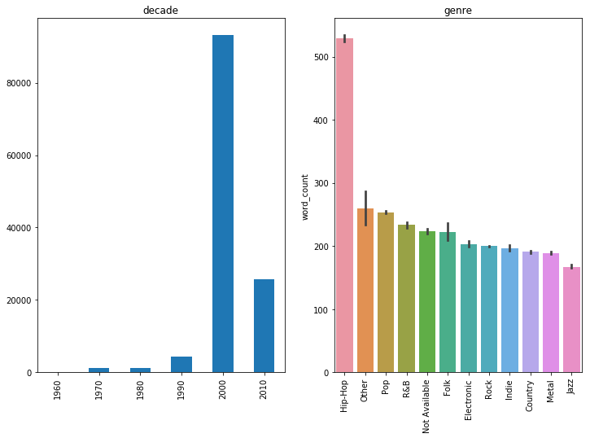


Before digging into the details of genre/artist differences, let's first take a look at the song productivity of decades from 1960s to 2010s. Here we can see that the 2000-2010 produced most songs, but that might due to collection problem. 


```python
#top 5 most productive artists
#df.groupby(["artist", "genre"])['word_count'].mean().reset_index().sort_values("word_count", ascending=False)
#df.loc[df['artist']=='dolly-parton']
#top5
#count >=10 & groupby artist [word_count]

#df_artist = df.groupby(['artist']).aggregate({
#    'artist':['count']  
#})
#top6 = df_artist.sort_values([('artist','count')], ascending=False).head(6)
#top6
#df.loc[[64363, 91139], :]
#df.groupby(['artist']).count() <10
#df.loc[df.groupby(['artist']).count()>=10,:]
#df.loc[df.groupby(['artist']).count()>=10]
#df.loc[df.artist.isin[()]
#df.loc[df.artist.isin(df_artist['artist'])]
#df['song_count']=
#df
#top6=
df.groupby(['artist', 'genre']).count().sort_values("song", ascending=False).head(5)
#df_clean["artist"].value_counts()
#result = df.groupby(["genre"])['word_count'].mean().reset_index().sort_values("word_count", ascending=False)
#df.groupby["artist"].count()#.sort_values(ascending=False).head(6)
```


<div>
<style scoped>
    .dataframe tbody tr th:only-of-type {
        vertical-align: middle;
    }

    .dataframe tbody tr th {
        vertical-align: top;
    }

    .dataframe thead th {
        text-align: right;
    }
</style>
<table border="1" class="dataframe">
  <thead>
    <tr style="text-align: right;">
      <th></th>
      <th></th>
      <th>song</th>
      <th>year</th>
      <th>lyrics</th>
      <th>word_count</th>
      <th>decade</th>
    </tr>
    <tr>
      <th>artist</th>
      <th>genre</th>
      <th></th>
      <th></th>
      <th></th>
      <th></th>
      <th></th>
    </tr>
  </thead>
  <tbody>
    <tr>
      <th>dolly-parton</th>
      <th>Country</th>
      <td>717</td>
      <td>717</td>
      <td>717</td>
      <td>717</td>
      <td>717</td>
    </tr>
    <tr>
      <th>elton-john</th>
      <th>Rock</th>
      <td>619</td>
      <td>619</td>
      <td>619</td>
      <td>619</td>
      <td>619</td>
    </tr>
    <tr>
      <th>chris-brown</th>
      <th>Hip-Hop</th>
      <td>596</td>
      <td>596</td>
      <td>596</td>
      <td>596</td>
      <td>596</td>
    </tr>
    <tr>
      <th>bee-gees</th>
      <th>Pop</th>
      <td>577</td>
      <td>577</td>
      <td>577</td>
      <td>577</td>
      <td>577</td>
    </tr>
    <tr>
      <th>bob-dylan</th>
      <th>Rock</th>
      <td>563</td>
      <td>563</td>
      <td>563</td>
      <td>563</td>
      <td>563</td>
    </tr>
  </tbody>
</table>
</div>


```python
artists=['dolly-parton','elton-john', 'chris-brown','bee-gees', 'bob-dylan']
top_5=df.loc[df['artist'].isin(artists)]
sns.boxplot(x="artist", y="word_count", data=top_5)
plt.xticks(rotation=90)
```


    (array([0, 1, 2, 3, 4]), <a list of 5 Text xticklabel objects>)


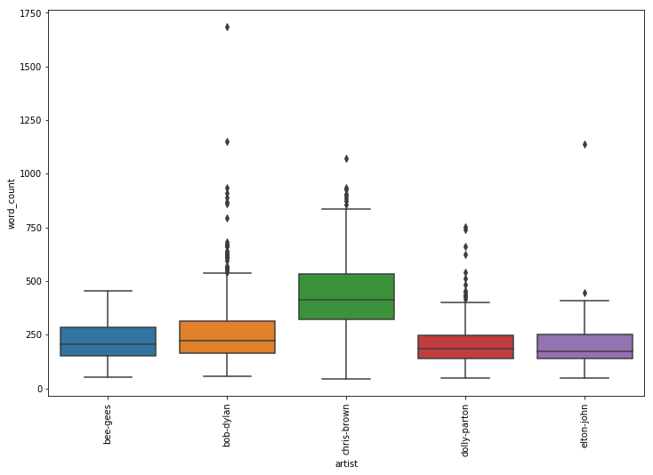


#Do musicians complain more or instruct more? If complaining, what do they hate?

#To get more details about the lyrics text of the 10 most eloquent artist, I created 10 corresponding wordclouds.


```python
# Create stopword list:
stopwords = set(STOPWORDS)
stopwords.update(["lot", "wanna", "wouldnt", "wasnt", "ha", "na", "ooh", "da",
        "gonna", "im", "dont", "aint", "wont", "yeah", "la", "oi", "nigga", "ya", "aah", "ye", "hey", 
        "ba", "da", "buh", "duh", "doo", "oh", "ooh", "woo", "uh", "hoo", "ah", "yead", "oo", "chorus", "beep", 
          "hey", "last", "past", "feel", "youre", "ll", "ve", "don"])
```


```python
#lyrics group by artist
def ofString(s):
    s= s.lower()
    s= s.replace('\n', ' ')
    s= s.replace(',', ' ')
    s= s.replace('\'', ' ')
    return s
```


```python
def allTextByArtist(df):
    D={}
    for ind,val in df.iterrows():
        art = val["artist"]
        if art in D:
            D[art]= D[art]+ ofString(str(val["lyrics"]))
        else:
            D[art]= ofString(str(val["lyrics"]))
    return D
```


```python
D= allTextByArtist(df)
```


```python
def drawCloud(s):
    wordclouddd = WordCloud(background_color="white",max_words=150,stopwords=stopwords).generate(s)
    #fig = plt.figure()
    #fig.set_figwidth(17)
    #fig.set_figheight(10)

    
    #plt.title('GG', color='#fafafa', size=30, y=1.01)
    #plt.annotate('GG', xy=(0, -.025), xycoords='axes fraction', fontsize=12, color='#fafafa')
    
    plt.imshow(wordclouddd)
    plt.axis("off")
    plt.figure()
    #plt.imshow(hcmask, cmap=plt.cm.gray)
    #plt.axis("off")
    #plt.show()
```


```python
drawCloud(D['dolly-parton'])
```


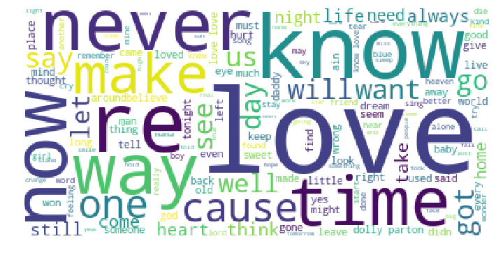


    <Figure size 864x576 with 0 Axes>


```python
drawCloud(D['elton-john'])
```


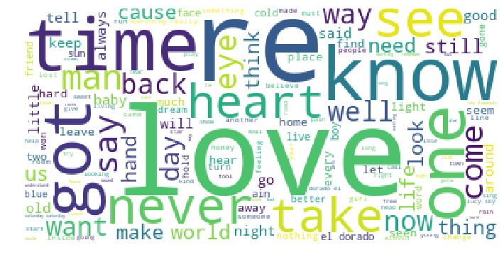


    <Figure size 864x576 with 0 Axes>


```python
drawCloud(D['chris-brown'])
```


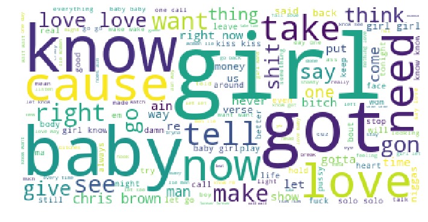


    <Figure size 864x576 with 0 Axes>


```python
drawCloud(D['bee-gees'])
```


    <Figure size 864x576 with 0 Axes>


```python
drawCloud(D['bob-dylan'])
```


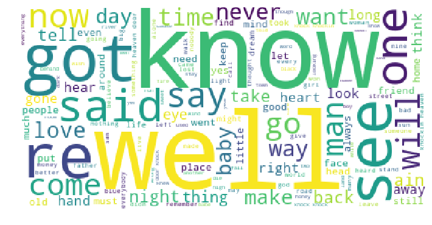


    <Figure size 864x576 with 0 Axes>


```python
sns.lineplot(x="year", y="word_count", data=top_5[top_5['artist']=='dolly-parton'])
```


    <matplotlib.axes._subplots.AxesSubplot at 0x129516a58>


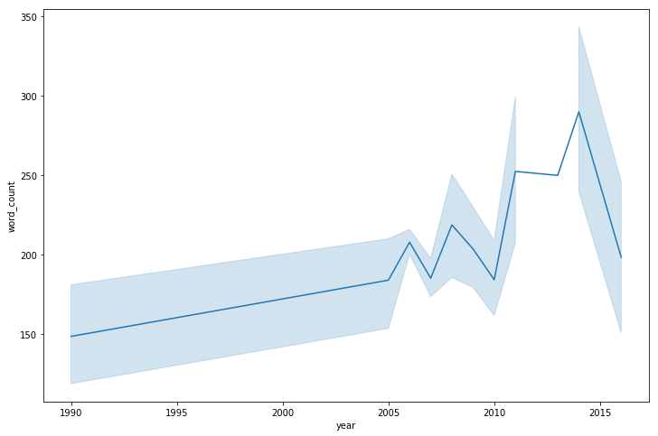


```python
sns.lineplot(x="year", y="word_count", data=top_5[top_5['artist']=='elton-john'])
```


    <matplotlib.axes._subplots.AxesSubplot at 0x11a393588>


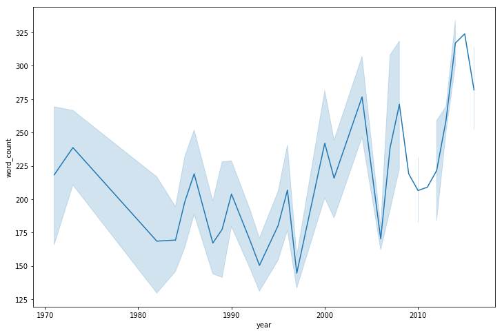


```python
sns.lineplot(x="year", y="word_count", data=top_5[top_5['artist']=='chris-brown'])
```


    <matplotlib.axes._subplots.AxesSubplot at 0x11a9c2ac8>


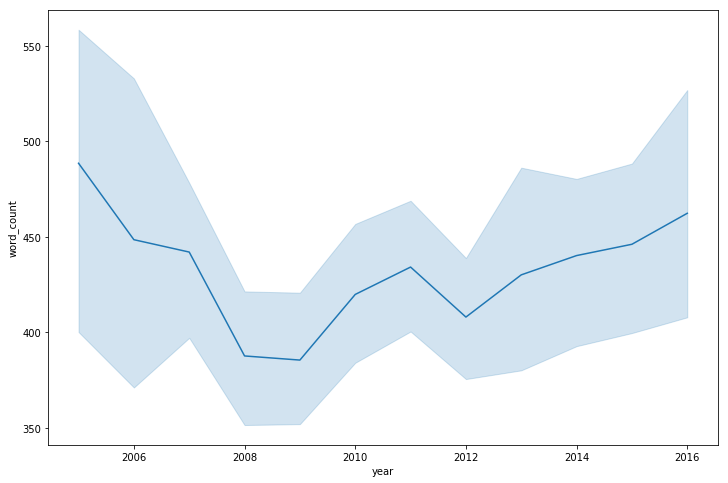


```python
sns.lineplot(x="year", y="word_count", data=top_5[top_5['artist']=='bee-gees'])
```


    <matplotlib.axes._subplots.AxesSubplot at 0x1290f2400>


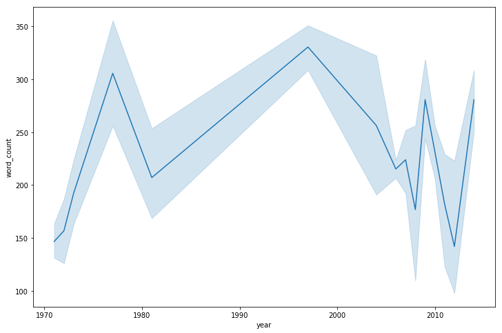


```python
sns.lineplot(x="year", y="word_count", data=top_5[top_5['artist']=='bob-dylan'])
```


    <matplotlib.axes._subplots.AxesSubplot at 0x126482240>


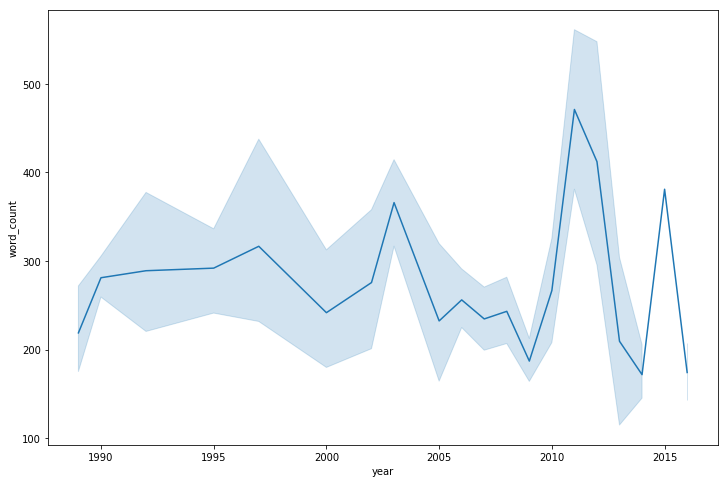

